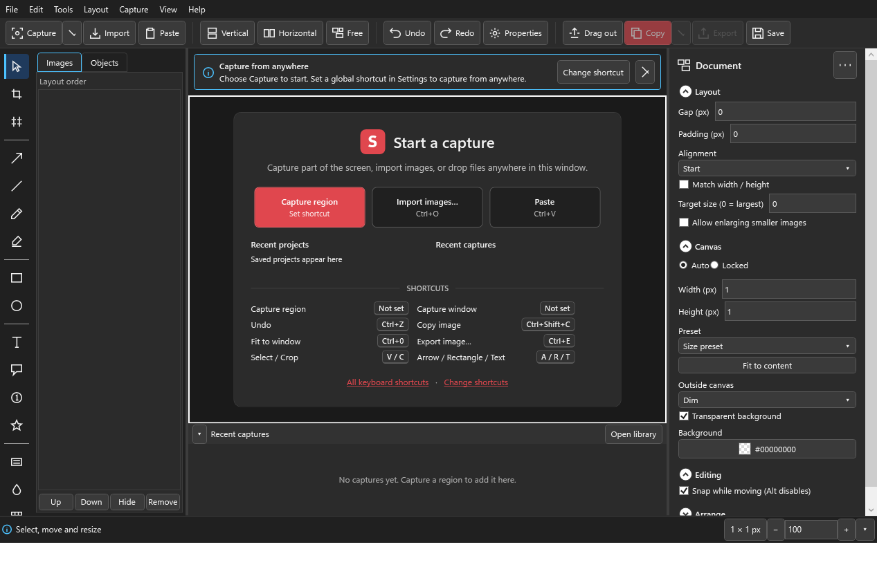

# SnagItOpen 0.2.0 (preview)

A local, offline Windows screenshot capture and image editor built around fast vertical/horizontal
combining and a free canvas. C# / .NET 10 / WPF. Not affiliated with TechSmith.

This is a **preview** with the approved UI/UX upgrade implemented: 437 automated tests pass.
Display hardware, external-app integration and assistive-technology acceptance remain open.
See [verification evidence](docs/evidence/verification.md) and [accessibility evidence](docs/evidence/ui-accessibility.md).
Developers and AI agents: start with [docs/HANDOFF.md](docs/HANDOFF.md).

## Install and run

- Install (per user, no admin): `.\scripts\install.ps1` (options `-StartWithWindows`, `-DesktopShortcut`).
  It installs to `%LOCALAPPDATA%\Programs\SnagItOpen` with a Start menu shortcut and an uninstaller.
- Closing the editor keeps SnagItOpen in the tray so hotkeys keep working. Quit from the tray menu.
- Portable: unzip `SnagItOpen-0.2.0-win-x64.zip` and run `SnagItOpen.exe`. User data is in
  `%LOCALAPPDATA%\SnagItOpen`.
- From source: see [BUILD.md](docs/BUILD.md).

## What it does

- **Combine:** drop, import or paste images; Vertical / Horizontal / Free layout; gap, padding,
  alignment, match width/height; drag or Alt+Up/Down to reorder.
- **Edit:** move, resize, snap, crop, rotate/flip, z-order, duplicate, canvas fit/size, scale,
  undo/redo; arrows, lines, rectangles, ellipses, text, callouts, highlight, numbered steps, freehand,
  stamps, magnifier, opaque redaction, blur/pixelate, borders/shadows/rounded/torn edges, strip cut-out,
  manual seam join.
- **Capture:** region, window (visible area), monitor, all monitors, last region, ellipse/freehand,
  fixed size/aspect, multiple regions, delay, cursor, scrolling (guided/automatic), interval. Captures
  can start a new composition, append below/right, go on the free canvas, or copy only.
- **Output and files:** copy image, PNG/JPEG export, editable `.sio` projects, pin to screen, recent
  captures library, layout and capture presets, global hotkeys, tray icon, autosave recovery.

Default hotkeys: PrintScreen region (Ctrl+PrintScreen if Windows reserves PrintScreen), Ctrl+Shift+2
window, Ctrl+Shift+3 append region, Ctrl+Shift+4 all monitors. Change them in Settings by pressing the
keys (Help → Keyboard shortcuts lists everything).

## UI upgrade

- Light, Dark and System themes, with automatic High contrast support and shared theme tokens.
- Icon command bar, red Copy action, 17-tool rail, optional Classic toolbar and responsive panels.
- Contextual inspector, mixed-value editing, style galleries, annotation snapping and spacing guides.
- Searchable settings, editable capture presets and a command palette (`Ctrl+K`).
- Immediate capture on release by default; optional Adjust phase with precise keyboard sizing,
  action bar, loupe, color sampling and in-overlay size/aspect choices.
- Capture toasts, searchable library, recoverable click-through pins and refreshed tray menus.

Dark editor render (test data; OS window frame omitted):

[Light narrow editor](docs/evidence/shell-Light-800-100.png) ·
[High contrast narrow editor](docs/evidence/shell-HighContrast-640-100.png)

## Known limitations

- Capture uses GDI: window capture shows overlapping windows; minimized or protected content is not
  captured. Mixed-DPI setups are designed for but not yet tested.
- Scrolling capture is best effort and falls back to manual seam correction.
- Blur/pixelate are visual only. Use Redact for secure hiding. Saved projects keep the original pixels.
- No OCR. Clipboard transparency depends on the receiving app.

## Planning documents

[Research](docs/RESEARCH.md) · [Specification](docs/superpowers/specs/2026-09-27-snagitopen-design.md) ·
[Plan](docs/superpowers/plans/2026-09-27-snagitopen.md) · [Capabilities](docs/CAPABILITIES.md) ·
[Acceptance checklist](docs/ACCEPTANCE.md)
